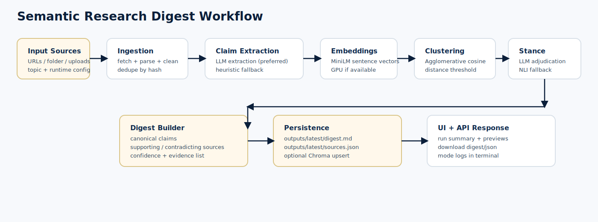

# Semantic Research Digest Agent

Semantic research pipeline built with FastAPI + LangGraph.

The app ingests sources (URLs, local folders, uploaded files), extracts grounded claims, clusters semantically similar claims, adjudicates support vs contradiction, and writes:

- `digest.md` (human-readable report)
- `sources.json` (structured machine-readable output)



## What the system does

Core pipeline steps:

1. **Ingestion**
   - Fetch URL content (`httpx`), parse/extract (`trafilatura`)
   - Read local `.txt/.html/.htm` files
   - Normalize and deduplicate sources by SHA256 content hash
2. **Claim Extraction**
   - Uses LLM extraction when runtime key/provider is available
   - Falls back to deterministic sentence extraction if LLM is unavailable/fails
3. **Embeddings**
   - Encodes claims with `sentence-transformers/all-MiniLM-L6-v2`
4. **Semantic Clustering**
   - Agglomerative clustering (cosine distance threshold)
5. **Stance + Confidence Adjudication**
   - Uses LLM adjudication per cluster (preferred)
   - Falls back to local NLI classifier if LLM adjudication is unavailable
6. **Digest + JSON Output**
   - Writes `digest.md` and `sources.json`
   - UI also supports in-page preview and direct download

## Project structure

```text
research_agent/
├── api/
│   ├── dependencies.py
│   └── routes.py
├── core/
│   ├── ingestion.py
│   ├── extraction.py
│   ├── embeddings.py
│   ├── clustering.py
│   ├── stance.py
│   ├── vector_store.py
│   ├── digest.py
│   └── graph.py
├── models/
│   └── claim_models.py
├── config.py
└── main.py
```

Compatibility wrappers remain under `app/` (`app.main`, `app.runner`, `app.graph`).

## Quick start (fresh clone)

### 1) Clone from GitHub

```bash
git clone https://github.com/sawanjr/Research-Digest-Agent.git
cd "Research Agent"
```

### 2) Create and activate virtual environment

Windows PowerShell:

```powershell
python -m venv .venv
.\.venv\Scripts\Activate.ps1
```

Windows CMD:

```bat
python -m venv .venv
.venv\Scripts\activate.bat
```

macOS/Linux:

```bash
python3 -m venv .venv
source .venv/bin/activate
```

### 3) Install dependencies

```bash
pip install --upgrade pip
pip install -r requirements.txt
```

### 4) Create environment file

```bash
copy .env.example .env
```

On macOS/Linux use:

```bash
cp .env.example .env
```

## LLM setup

You can run with Groq, OpenAI, or Anthropic.

Set keys in `.env` (optional fallback), for example:

```env
DEFAULT_LLM_PROVIDER=groq
DEFAULT_MODEL_NAME=openai/gpt-oss-120b

GROQ_API_KEY=...
OPENAI_API_KEY=...
ANTHROPIC_API_KEY=...
```

Runtime key/provider precedence:

1. Request headers (`X-API-KEY`, `X-API-PROVIDER`)
2. Request body (`api_key`, `api_provider`)
3. `.env` fallback (`*_API_KEY` for selected provider)

In the UI, provider/key are configured via the **LLM Settings** popup and stored locally in browser storage.

## LangSmith tracing

LangSmith can trace LangChain/LangGraph LLM calls used by:

- claim extraction (LLM path)
- cluster adjudication (LLM stance/confidence path)

1) Create a LangSmith account and API key.

2) Set these in `.env`:

```env
LANGSMITH_TRACING=true
LANGSMITH_API_KEY=...
LANGSMITH_PROJECT=research-digest-agent
LANGSMITH_ENDPOINT=https://api.smith.langchain.com
```

Notes:

- The app configures `LANGCHAIN_TRACING_V2`, `LANGCHAIN_PROJECT`, and `LANGCHAIN_ENDPOINT` automatically when `LANGSMITH_TRACING=true` (compat for LangChain versions that still read the `LANGCHAIN_*` env vars).
- You can also set `LANGCHAIN_API_KEY` instead of `LANGSMITH_API_KEY` if you prefer, but `LANGSMITH_API_KEY` is recommended.

3) Start the server and run a job.

You should see traces grouped under the project name. Each run is tagged:

- `research_agent`, `extraction`
- `research_agent`, `stance`

## GPU usage

The app automatically prefers GPU when available:

- Embeddings: `cuda`/`mps`/`cpu` auto-selection
- Local NLI fallback: uses CUDA for transformer pipeline when available

If you need explicit CUDA-enabled PyTorch, install the correct wheel for your CUDA version from the official PyTorch instructions.

## Run the app

Primary FastAPI entrypoint:

```bash
uvicorn research_agent.main:app --reload
```

Compatibility entrypoint:

```bash
uvicorn app.main:app --reload
```

Open browser at `http://127.0.0.1:8000`.

## Run from CLI

```bash
python -m app.runner --topic "RAG" --folder-path "inputs/local_sources"
```

`sample_inputs/` is intentionally git-ignored; keep any local datasets there if you want, but don’t rely on it existing in fresh clones.

Useful options:

- `--grouping-threshold 0.4`
- `--api-provider groq|openai|anthropic`
- `--api-key <runtime_key>`
- `--use-vector-store`

## Output files

Server writes output to the requested output directory (default `outputs/latest`):

- `digest.md`
- `sources.json`

UI also allows downloading both files directly without manually entering output directory.

## How to verify AI vs fallback mode

Check terminal logs while a run is executing.

Extraction logs:

- `extraction.source_mode` -> `mode=ai` or `mode=fallback` per source
- `extraction.mode_summary` -> totals for AI and fallback

Stance logs:

- `stance.cluster_mode` -> `mode=llm` or `mode=fallback` per cluster
- `stance.mode_summary` -> totals for LLM and fallback

## Tests

```bash
pytest -q
```

## Common troubleshooting

- **422 Unprocessable Entity**
  - Ensure at least one input source is provided (URL, folder, or uploaded files)
  - Ensure `topic` is not empty
- **All clusters show 0% or 100% confidence**
  - This usually means no mixed support/contradict evidence in same cluster
  - Adjust clustering threshold or provide intentionally conflicting sources
- **LLM not being used**
  - Check logs for `mode=fallback`
  - Verify provider and API key in LLM Settings or `.env`
- **Slow first run**
  - Initial model downloads (embeddings/NLI) can take time
